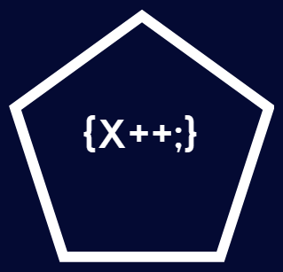

<h2>Hi 👋 I'm Christian</h2>

- 🔭 I’m currently a: **Software Engineer and .NET developer using C# and Web technologies**
- 🌱 I’m currently learning: **Deno with typescript**
- 🏅 Recognized as a **[Microsoft MVP](https://mvp.microsoft.com/en-US/MVP/profile/079507f9-3c9a-e411-93f2-9cb65495d3c4)** from 2015-Present
- 💬 Ask me about: **[.NET](https://dotnet.microsoft.com/en-us/), [C#](https://learn.microsoft.com/en-us/dotnet/csharp/tour-of-csharp/), [Cloud Engineering (Azure)](https://azure.microsoft.com/en-us), [Dynamics 365 Business Central](https://dynamics.microsoft.com/en-us/business-central/overview/), Software Development...**
- 📫 Connect on **[Twitter](https://twitter.com/christianamado), [LinkedIn](https://www.linkedin.com/in/christianamado/), and GitHub**  
 

<h2>🔧 Technologies & Tools</h2>
<table>
	<tr>
		<td align="center" width="150">
			
<b>Operating System</b>

		</td>
		<td align="center" width="96">
			
			
Windows

		</td>
		<td align="center" width="96">
			
			
Ubuntu

		</td>
		<td align="center" width="96">
		  &nbsp;
		</td>
		<td align="center" width="96">
		  &nbsp;
		</td>
		<td align="center" width="96">
		  &nbsp;
		</td>
	</tr>
	<tr>
		<td align="center" width="150">
			
<b>Languages</b>

		</td>
		<td align="center" width="96">
		  
		  
C#

		</td>
		<td align="center" width="96">
		  
		  
AL - C/SIDE

		</td>
		<td align="center" width="96">
		  
		  
X++

		</td>
		<td align="center" width="96">
		  &nbsp;
		  <!--a href="https://go.dev/" target="_blank">
			
		  </a>
		  
Go</p-->
		</td>
		<td align="center" width="96">
		  &nbsp;
		  <!--a href="https://www.python.org/" target="_blank">
			
		  </a>
		  
Python</p-->
		</td>
	</tr>
	<tr>
		<td align="center" width="150">
			
<b>Frameworks</b>

		</td>
		<td align="center" width="96">
			
			
.NET

		</td>
		<td align="center" width="96">
		   &nbsp;
		  <!--
		  
Blazor
-->
		</td>
		<td align="center" width="96">
		   &nbsp;
		   <!--
		  
jQuery
-->
		</td>
		<td align="center" width="96">
		  &nbsp;
		</td>
		<td align="center" width="96">
		  &nbsp;
		</td>
	</tr>
	<tr>
		<td align="center" width="150">
			
<b>IDEs</b>

		</td>
		<td align="center" width="96">
		  
		  
Visual Studio

		</td>
		<td align="center" width="96">
		  
		  
VS Code

		</td>
		<td align="center" width="96">
		  
		  
DataGrip

		</td>
		<td align="center" width="96">
		  &nbsp;
		  <!--
		  
Rider
-->
		</td>
		<td align="center" width="96">
		  &nbsp;
		</td>
	</tr>
	<tr>
		<td align="center" width="150">
			
<b>Databases</b>

		</td>
		<td align="center" width="96">
		  
		  
Azure SQL Server

		</td>
		<td align="center" width="96">
		  
		  
PostgreSQL

		</td>
		<td align="center" width="96">
	           &nbsp;
		  <!--
		  
Oracle
-->
		</td>
		<td align="center" width="96">
		  &nbsp;
		</td>
		<td align="center" width="96">
		  &nbsp;
		</td>
	</tr>
	<tr>
		<td align="center" width="150">
			
<b>DevOps</b>

		</td>
		<td align="center" width="96">
		  
		  
GitHub

		</td>
		<td align="center" width="96">
		  
		  
Azure DevOps

		</td>
		<td align="center" width="96">
		  &nbsp;
		</td>
		<td align="center" width="96">
		  &nbsp;
		</td>
		<td align="center" width="96">
		  &nbsp;
		</td>
	</tr>
	<tr>
		<td align="center" width="150">
			
<b>Business Applications</b>

		</td>
		<td align="center" width="96">
		  
		  
Power Automate

		</td>
		<td align="center" width="96">
		  
		  
Power Apps

		</td>
		<td align="center" width="96">
		  
		  
Business Central

		</td>
		<td align="center" width="96">
		  
		  
Power Pages

		</td>
		<td align="center" width="96">
		  
		  
Dynamics 365

		</td>
	</tr>
	<tr>
		<td align="center" width="150">
			
<b>Another Stuffs</b>

		</td>
		<td align="center" width="96">
		  
		  
Postman

		</td>
		<td align="center" width="96">
		  
		  
Microsoft 365

		</td>
		<td align="center" width="96">
		  
		  
Microsoft Entra ID

		</td>
		<td align="center" width="96">
		  
		  
Azure AI

		</td>
		<td align="center" width="96">
		  
		  
Azure API Management

		</td>
	</tr>
</table>
